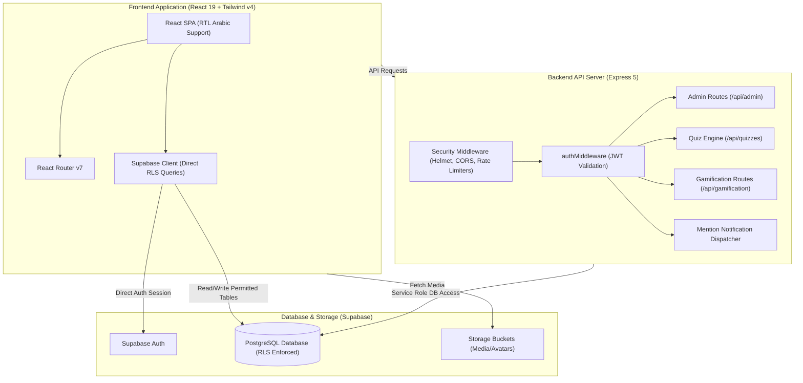

# Manarat Al-Daad Platform (منارة الضاد)

A modern, full-stack Arabic educational e-learning and examination platform engineered with **React 19**, **Tailwind CSS v4**, **Node.js/Express 5**, and **Supabase (PostgreSQL with Row Level Security)**. The platform delivers interactive course modules, automated quiz and exam evaluations, student gamification with XP and streaks, real-time community chat with mention notifications, and an administrative control panel.

---

## Table of Contents

- [Features](#features)
- [Tech Stack](#tech-stack)
- [Architecture](#architecture)
- [Project Structure](#project-structure)
- [Installation & Setup](#installation--setup)
- [License](#license)
- [Author](#author)

---

## Features

### Student Learning & Assessment
- **Curriculum & Lesson Modules**: Structured course viewer supporting bilingual/RTL Arabic localization via `i18next` and `react-i18next`.
- **Examination & Quiz Engine (`/api/quizzes`)**: Time-restricted quizzes with automated server-side evaluation, score aggregation, and detailed student answer reviews.
- **Gamification System (`/api/gamification`)**: Student engagement tracking with experience points (XP), level progressions, daily attendance streaks, and competitive leaderboards.
- **Community Chat & Mentions**: Real-time study discussions featuring user mentions (`@user`) and authenticated notifications (`/api/chat/mention-notify`).
- **Subscription Management**: Subscription status tracking and access control with automated expiration handlers.

### Administration & Security
- **Administrative Portal (`/api/admin`)**: Platform configuration controls, exam/quiz authoring, student account management, and performance analytics.
- **Security Hardening**:
  - Full PostgreSQL **Row Level Security (RLS)** policy enforcement preventing unauthorized data access across tenants.
  - Strict Express rate limiters mitigating brute-force authentication attacks and API enumeration.
  - HTTP header protection via [Helmet](https://helmetjs.github.io/) and body-size limits against DoS attacks.
  - JWT token validation ensuring cryptographically verified sender identities on notification endpoints.

---

## Tech Stack

### Frontend (`/frontend`)
- **Framework**: React 19 (`^19.2.7`), Vite 5 (`^5.4.21`)
- **Styling**: Tailwind CSS v4 (`^4.3.1`) with `@tailwindcss/vite`
- **Routing & State**: React Router DOM 7 (`^7.18.0`), Supabase Client (`^2.108.2`)
- **Animation & Icons**: Framer Motion (`^12.42.0`), Lucide React (`^1.22.0`)
- **Internationalization**: `i18next` (`^26.3.3`), `react-i18next` (`^17.0.8`) with RTL Arabic support
- **Feedback**: React Hot Toast (`^2.6.0`)
- **Linter**: Oxlint (`^1.69.0`)

### Backend (`/backend`)
- **Runtime**: Node.js, Express 5 (`^5.2.1`)
- **Database Client**: `@supabase/supabase-js` (`^2.108.2`)
- **Security Middleware**: Helmet (`^8.3.0`), Express Rate Limit (`^8.7.0`), CORS (`^2.8.6`)
- **Configuration**: Dotenv (`^17.4.2`)

### Database & Storage
- **Engine**: Supabase (PostgreSQL 15+)
- **Security Architecture**: Row Level Security (RLS) policies (`security_hardening_master.sql`, `database_schema.sql`)
- **Object Storage**: Configured buckets for educational media and avatars (`setup_storage.sql`)

---

## Architecture



---

## Project Structure

```text
Manarat_Al_Daad_Platform/
├── frontend/
│   ├── src/
│   │   ├── components/      # UI components (Quiz cards, Leaderboard, Navbar, etc.)
│   │   ├── pages/           # Application views (Home, Dashboard, Quiz, Admin, etc.)
│   │   ├── context/         # Auth, Language, and Gamification contexts
│   │   ├── lib/             # Supabase client instantiation
│   │   ├── App.jsx          # Root router configuration
│   │   └── main.jsx         # Vite entry point
│   ├── package.json         # Frontend dependencies and Vite build scripts
│   ├── vite.config.js       # Vite configuration with Tailwind v4 plugin
│   └── vercel.json          # Frontend deployment routing
├── backend/
│   ├── src/
│   │   ├── routes/          # Express route definitions (admin, auth, quiz, gamification)
│   │   ├── middlewares/     # Authentication protection and role validation
│   │   └── lib/             # Backend Supabase admin client
│   ├── server.js            # Express application bootstrap and middleware configuration
│   └── package.json         # Backend dependencies
├── database_schema.sql      # Core PostgreSQL schema
├── security_hardening_master.sql # Master RLS and database security hardening script
├── setup_exams.sql          # Exam schema and table structure
├── setup_notifications.sql  # Notification schema and functions
├── subscriptions_setup.sql  # Subscription schema and automated expiration triggers
└── README.md
```

---

## Installation & Setup

### Prerequisites
- [Node.js](https://nodejs.org/) (v18.x or higher)
- [npm](https://www.npmjs.com/)
- A [Supabase](https://supabase.com/) project (PostgreSQL instance, Anon Key, and Service Role Key)

### 1. Database Initialization
Execute the SQL migrations in your Supabase SQL Editor in the following sequence:
1. `database_schema.sql`
2. `security_hardening_master.sql`
3. `setup_exams.sql`
4. `setup_notifications.sql`
5. `subscriptions_setup.sql`

### 2. Environment Variables

Create `.env` in the backend and frontend directories:

**Backend (`backend/.env`)**:
```env
PORT=5000
SUPABASE_URL=https://your-supabase-project.supabase.co
SUPABASE_SERVICE_ROLE_KEY=your_service_role_key
FRONTEND_URL=http://localhost:5173
```

**Frontend (`frontend/.env`)**:
```env
VITE_SUPABASE_URL=https://your-supabase-project.supabase.co
VITE_SUPABASE_ANON_KEY=your_anon_key
VITE_API_URL=http://localhost:5000
```

### 3. Running the Platform

1. **Start Backend**:
   ```bash
   cd backend
   npm install
   node server.js
   ```
   The backend API will listen on `http://localhost:5000`.

2. **Start Frontend**:
   ```bash
   cd ../frontend
   npm install
   npm run dev
   ```
   The frontend application will start on `http://localhost:5173`.

---

## License

ISC License (as specified in package configuration).

---

## Author

- **Mohamed Ghanem** - [Eng-Ghanem](https://github.com/Eng-Ghanem)
